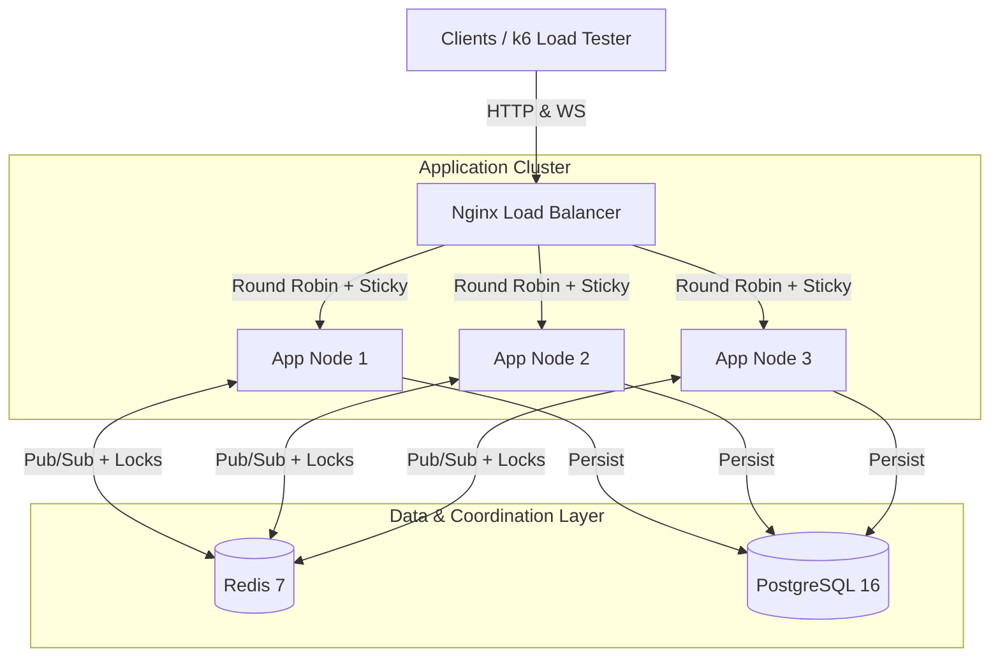

# BidFlow: High-Performance Distributed Auction Engine


**BidFlow** is a robust, concurrent, and scalable backend system designed to handle real-time auctions under heavy load.
It leverages **Java 21 Virtual Threads** for high-throughput I/O and **Redis** for distributed coordination, ensuring
data integrity across a clustered environment.

## 🏗 Architecture

The system is designed as a distributed cluster to simulate a real-world production environment where horizontal scaling
is mandatory.



### Key Technical Decisions

1. **Distributed Locking (Redisson):**
    * *Problem:* Prevents "Double Spending" or Race Conditions where two users bid on the same item simultaneously on
      different server nodes.
    * *Solution:* A Redis-based Mutex lock wraps the bidding logic, acting as the "Single Source of Truth" for
      concurrency control.

2. **Real-Time State Synchronization (Redis Pub/Sub):**
    * *Problem:* If User A bids on Node 1, User B on Node 2 needs to see that update instantly via WebSocket.
    * *Solution:* A custom **Redis-to-STOMP Relay** broadcasts events to all nodes in the cluster. Each node then pushes
      the update to its locally connected WebSocket clients.

3. **Virtual Threads (Project Loom):**
    * *Problem:* Traditional thread-per-request models struggle with thousands of concurrent connections (WebSocket +
      HTTP).
    * *Solution:* Enabled **Spring Boot 4** native support for Java 21 Virtual Threads, allowing high-throughput
      handling of blocking I/O (Database/Redis calls) with minimal memory footprint.

4. **Load Balancing & Sticky Sessions:**
    * *Problem:* The SockJS protocol requires multi-step handshakes (HTTP -> Upgrade). Standard Round-Robin breaks this
      flow.
    * *Solution:* Nginx configured with `ip_hash` to ensure session affinity (Sticky Sessions) during the WebSocket
      handshake phase.

---

## 🛠 Tech Stack

* **Language:** Java 21
* **Framework:** Spring Boot 4.0.1
* **Database:** PostgreSQL 16
* **Coordination/Cache:** Redis 7.2 (Redisson Client 4.1.0)
* **Real-Time:** WebSockets (STOMP / SockJS)
* **Containerization:** Docker & Docker Compose
* **Load Balancing:** Nginx
* **Testing:** k6 (Load Testing)

---

## 🚀 Getting Started

### Prerequisites

* Docker & Docker Compose
* Java 21 SDK (optional, for local dev)
* k6 (for load testing)

### Running the Cluster

To spin up the full environment (Database, Redis, Nginx, and 3 App Nodes), use the cluster definition file:

```bash
# Builds the JAR and starts the containers defined in the cluster config
docker compose -f docker-compose-cluster.yml up --build
```

Access the application at:

* **Frontend (Demo):** `http://localhost/bidflow/index.html`
* **API:** `http://localhost/bidflow/auctions`

*Note: The system automatically seeds a demo auction (ID: 1) on startup if the database is empty (via the `dev`
profile).*

---

## 🧪 Load Testing

The project includes a sophisticated **k6** script to simulate high-concurrency scenarios (e.g., 1,000 users bidding
simultaneously).

### 1. Test Single Node (Local Dev)

If running via IDE on port 8080:

```bash
k6 run -e TARGET=local load-test.js
```

### 2. Test Cluster (Docker + Nginx)

If running via Docker Compose on port 80:

```bash
k6 run -e TARGET=cluster load-test.js
```

### Expected Results

Even with 1,000 concurrent Virtual Users (VUs) and thousands of bids:

* **Data Integrity:** 100% (Zero race conditions).
* **WebSocket Success:** 100% (Thanks to Sticky Sessions).
* **Latency:** Low latency due to Virtual Threads and Redis efficiency.

---

## 📂 Project Structure

* `src/main/java/com/nsdev/bidflow`
    * `domain`: Core business logic (Auctions, Bids).
    * `infra/messaging`: Redis Pub/Sub Publisher & Listener.
    * `config`: Redis, WebSocket, and Jackson configurations.
    * `web`: Controllers and DTOs.
* `load-test.js`: k6 script for performance validation.
* `nginx.conf`: Load Balancer configuration with WebSocket support.
* `docker-compose-cluster.yml`: Production-like Cluster orchestration.
* `docker-compose-dev.yml`: (Optional) Simple dev environment.

---

## 📝 Serialization Strategy

To ensure robustness across the cluster, we use a **"Pure JSON"** strategy for Redis messages.
Instead of relying on Java Serialization or Jackson's polymorphic `@class` headers (which cause compatibility issues),
we manually serialize domain events to JSON strings before publishing to Redis. This ensures the system is loosely
coupled and resilient to version changes.